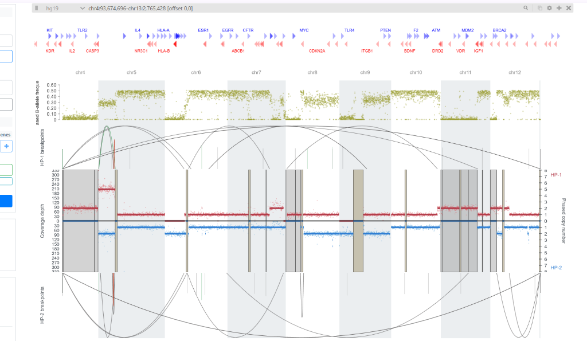

# ViScanner

> **Note**: This project is an updated and extended version of the original [ViScanner](https://compbio.hms.harvard.edu/ViScanner/) developed by the Park Lab at Harvard Medical School. This version adds native support for WAKHAN haplotype phasing, Severus structural variation arcs, dynamic multi-build centromere masking, in-memory example dataset loading, and a centralized default configuration system.

[Live Application Demo](https://wakhan-visualization.github.io/)

---

## Overview

ViScanner is an interactive, web-based genomic visualization tool designed for single-cell and bulk cancer genomics. It enables simultaneous exploration of:
- **Copy Number Alterations (CNA)**
- **B-Allele Frequencies (BAF)**
- **Haplotype-Specific Mirrored Coverage (HP1 / HP2)**
- **Structural Variant (SV) Breakpoints and Arcs**
- **Loss of Heterozygosity (LOH) and Centromere Masked Regions**

---

## Key Features

- **Multi-Pipeline Data Ingestion**: Native compatibility with WAKHAN haplotype phasing outputs, Severus somatic structural variants (VCF), and classic HiScanner CNA outputs.
- **In-Memory Instant Example Loading**: Load complete demo datasets with zero file download dialogs or external network dependency.
- **Dual-Axis Mirrored Haplotype Track**: Mirrored upper/lower plots for HP1 and HP2 with live depth/CN point scaling, segment confidence, and LOH region overlays.
- **Phased Structural Variant Arcs**: Haplotype-aware arc connections and vertical breakpoint markers for `DEL`, `INS`, `INV`, `DUP`, and `BND` variants.
- **Multi-Build Reference Masking**: Dynamic switching between **GRCh38**, **GRCh37**, and **CHM13** centromere masking datasets.
- **Centralized Default Settings**: Easily customize initial track visibilities, default coordinates, and SV filters via `src/defaultSettings.js`.
- **Interactive Segment Browser**: Filterable WAKHAN segment table with 1-click locus navigation (`Inspect region`) and CSV export.
- **High-Resolution Vector PDF Export**: Export publication-quality vector figures directly from the web canvas.

---

## Interface Previews

### Upload Interface & WAKHAN Segment Browser


### Whole-Genome Multi-Track Visualizer (HP1, HP2, BAF & SV Arcs)


### Zoomed Genomic Region & Breakpoint Inspection


---

## Supported Input Files

You can upload individual raw files or a single `.zip` archive containing any of the following:

| File Name / Pattern | Format | Description |
| :--- | :--- | :--- |
| `phase_corrected_coverage.csv` | CSV | Dense phased coverage depth points (`chr`, `start`, `end`, `hp1`, `hp2`, `unphased`) |
| `*_copynumbers_segments_HP_1.bed` | BED | Haplotype 1 copy-number segments and confidence scores |
| `*_copynumbers_segments_HP_2.bed` | BED | Haplotype 2 copy-number segments and confidence scores |
| `baf.csv` | CSV | Phased B-Allele Frequency values (`chr`, `start`, `end`, `baf`) |
| `severus_somatic.vcf` | VCF | Somatic structural variants (`PASS` filtered) |
| `*_LOH*.bed` / `loh_regions.bed` | BED | Loss of Heterozygosity (LOH) region coordinates |
| `grch38.cen_coord.curated.bed` / `grch37` / `chm13` | BED | Centromere masked region coordinates |
| `cna_long.txt` / `cna_short.txt` | TSV | Classic HiScanner CNA segment files |

---

## How to Make Changes and Deploy

### 1. Customizing Default Track Settings
All default visibilities, initial coordinates, and filter settings are located in:
`src/defaultSettings.js`

Open the file and change any `true` or `false` value:
- `showHp1`, `showHp2`, `showCoveragePoints`: Toggle Copy Number track layers.
- `showHpSvTrack`, `showSvLinesInCopyNumber`: Toggle SV arc track and breakpoint lines.
- `showLohRegions`, `showMaskedRegions`: Toggle LOH and centromere bands.
- `svTypes`: Enable or disable specific SV types (`DEL`, `INV`, `INS`, `BND`, `DUP`, `sBND`).

### 2. Updating Sample Example Files
To change or replace any of the example files (e.g. `loh_regions.bed`, `baf.csv`):
1. Put your new file in `examples/source_files/`.
2. Run `npm run update-example-data` to re-package the in-memory dataset.

### 3. Deploying Your Updates Live
Whenever you make any change and want it live on GitHub Pages, run:
```bash
npm run deploy
```
This single command automatically:
- Recompiles the production bundle (`dist/`).
- Force-updates the `gh-pages` branch on GitHub.
- Synchronizes `/docs` and root `/`.
- Commits and pushes to `main` across all remotes.

*(After deploying, wait ~45 seconds and press `Ctrl` + `F5` on the live site to view your updates).*

---

## Development and Setup

### Prerequisites
- Node.js (`v16.x` or newer)
- npm (`v8.x` or newer)

### Installation
```bash
git clone https://github.com/wakhan-visualization/wakhan-visualization.github.io.git
cd wakhan-visualization.github.io
npm install
```

### Local Development Server
Start the local development server at `http://localhost:3030`:
```bash
npm start
```

### Running Unit Tests
```bash
npm test
```

---

## Git Workflow

To manually stage, commit, and push changes to GitHub:
```bash
git add -A ; git commit -m "Describe your changes" ; git push origin main
```
*(On Linux/macOS, use `git add -A && git commit -m "..." && git push origin main`)*


