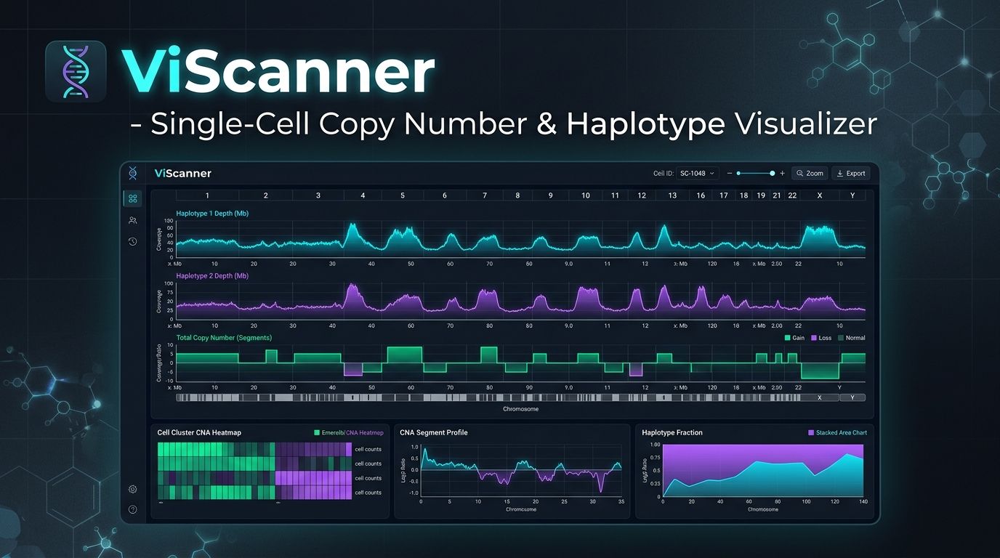
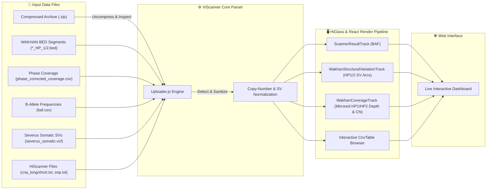

<div align="center">



# 🧬 ViScanner

### Interactive Single-Cell Copy Number Alteration & Haplotype Visualization Engine

[](https://www.nature.com/articles/s41467-025-60446-5)
[](https://Rahim36712.github.io/viscanner-improved)
[](https://reactjs.org/)
[](https://higlass.io/)
[](LICENSE)

[**🌐 Live Application Demo**](https://Rahim36712.github.io/viscanner-improved) &nbsp;|&nbsp; [**📄 Read the Paper**](https://www.nature.com/articles/s41467-025-60446-5) &nbsp;|&nbsp; [**📖 User Guide**](#-supported-file-formats--input-specifications)

---

</div>

## 📌 Overview

**ViScanner** is a web-based genomic visualizer designed for interactive exploration of **Copy Number Alterations (CNA)**, **B-allele Frequencies (BAF)**, **Haplotype-Specific Coverage Profiles (HP1 / HP2)**, and **Structural Variant (SV)** breakpoint callouts at single-cell resolution. 

It seamlessly integrates with **HiScanner** outputs and extends support for **WAKHAN** haplotype phasing pipelines alongside **Severus** structural variant calls.


---

## ✨ Key Features

- 🔬 **HiScanner & WAKHAN Data Engine**: Supports classic HiScanner CNA segment files as well as multi-haplotype WAKHAN outputs in raw or `.zip` format.
- 🔀 **Mirrored HP1 / HP2 Coverage Track**: Custom HiGlass track displaying HP1 above and HP2 below a central baseline with dual depth (left) and copy-number equivalent (right) axes.
- 🎯 **Structural Variant (SV) Arc Visualizer**: Plots Severus structural variants (`DEL`, `INV`, `INS`, `BND`, `DUP`, `sBND`) with haplotype-aware separation (`INFO/HP=1` vs `INFO/HP=2`).
- 📊 **Enhanced B-Allele Frequency (BAF) Track**: Phased BAF plotting (`0` to `0.6` range) with alternating chromosome background shading.
- 📑 **Interactive Segment Browser**: Filterable data table displaying copy number states, confidence scores, and one-click eye icons (`👁️`) for smooth canvas navigation.
- 🎛️ **Granular Visibility Controls**: Independent toggles for haplotype tracks, coverage scatter points, SV line overlays, and SV type filters.

---

## 🖥️ User Interface & Data Browser

ViScanner features an interactive segment browser paired with live region inspection:


### System Data Flow



---

## 📂 Supported File Formats & Input Specifications

ViScanner accepts `.zip` archives containing the target dataset or individual uncompressed raw files.

### 1. WAKHAN + Severus Pipeline Output (Recommended)

| File Name | Format | Description | Required Columns / Schema |
| :--- | :--- | :--- | :--- |
| `phase_corrected_coverage.csv` | CSV | Dense phase coverage depth points | `chr`, `start`, `end`, `hp1`, `hp2`, `unphased` |
| `*_copynumbers_segments_HP_1.bed` | BED | HP1 copy-number segments | `chr`, `start`, `end`, `coverage`, `copynumber_state`, `confidence`, `svs_breakpoints_ids` |
| `*_copynumbers_segments_HP_2.bed` | BED | HP2 copy-number segments | `chr`, `start`, `end`, `coverage`, `copynumber_state`, `confidence`, `svs_breakpoints_ids` |
| `baf.csv` | CSV | B-Allele Frequency values | `chr`, `start`, `end`, `baf` |
| `severus_somatic.vcf` | VCF | Somatic Structural Variants | `PASS` filtered VCF with `SVTYPE`, `SVLEN`, `HP`, `VAF`, `DV`, `MATE_ID` |

### 2. Classic HiScanner Format

| File Name | Format | Description | Required Columns |
| :--- | :--- | :--- | :--- |
| `cna_long.txt` | TSV | Bin-level CNA data | `chrom`, `start`, `end`, `major_cn`, `minor_cn`, `total_cn`, `rdr`, `baf`, `cell` |
| `cna_short.txt` | TSV | Segment-level CNA data | `chrom`, `start`, `end`, `major_cn`, `minor_cn`, `total_cn`, `rdr`, `baf`, `cell` |
| `snp.txt` | TSV | Cell-specific SNP locations | `chrom`, `pos`, `<cell_id>` |

---

## 🎨 Haplotype & Coverage Normalization Rules

- **Copy Number Equivalent Mapping**:
  $$\text{CopyNumberEquivalent} = \left( \frac{\text{RawCoverage}}{\text{BedSegmentCoverage}} \right) \times \text{BedCopyNumberState}$$
  This positions individual coverage scatter points dynamically relative to the right-axis integer copy-number ticks.
- **Dynamic Max Coverage Axis**:
  $$\text{CoverageMax} = \max\left(180, \; \text{Ceil}_{30}(\text{MaxBedSegmentCoverage})\right)$$
  Prevents high-coverage segments from clipping while maintaining baseline proportion.
- **SV Endpoint Hover Isolation**:
  Large structural variants spanning millions of base-pairs are filtered by active viewport bounds, preventing crossing arcs from stealing hover focus.

---

## 🚀 Quick Start & Development Guide

### Prerequisites
- **Node.js**: `v16.x` or `v18.x`
- **npm**: `v8.x` or higher

### Local Setup

1. **Clone the Repository**:
   ```bash
   git clone https://github.com/Rahim36712/viscanner-improved.git
   cd viscanner-improved
   ```

2. **Install Dependencies**:
   ```bash
   npm install
   ```

3. **Start Development Server**:
   ```bash
   npm start
   ```
   Open `http://localhost:3030` in your web browser.

4. **Build Production Bundle**:
   ```bash
   npm run build
   ```

5. **Deploy to GitHub Pages**:
   ```bash
   npm run deploy
   ```

---

## 📜 Citation & Credits

If you use **ViScanner** in your research, please cite our *Nature Communications* paper:

```bibtex
@article{viscanner2025,
  title={Single-cell copy number alteration profiling at scale with HiScanner},
  journal={Nature Communications},
  year={2025},
  url={https://www.nature.com/articles/s41467-025-60446-5}
}
```

Developed by **Park Lab** (Harvard Medical School) & **Kolmogorov Lab**.

---

<div align="center">
  <sub>Maintained by Park Lab & Kolmogorov Lab &bull; Licensed under MIT</sub>
</div>
