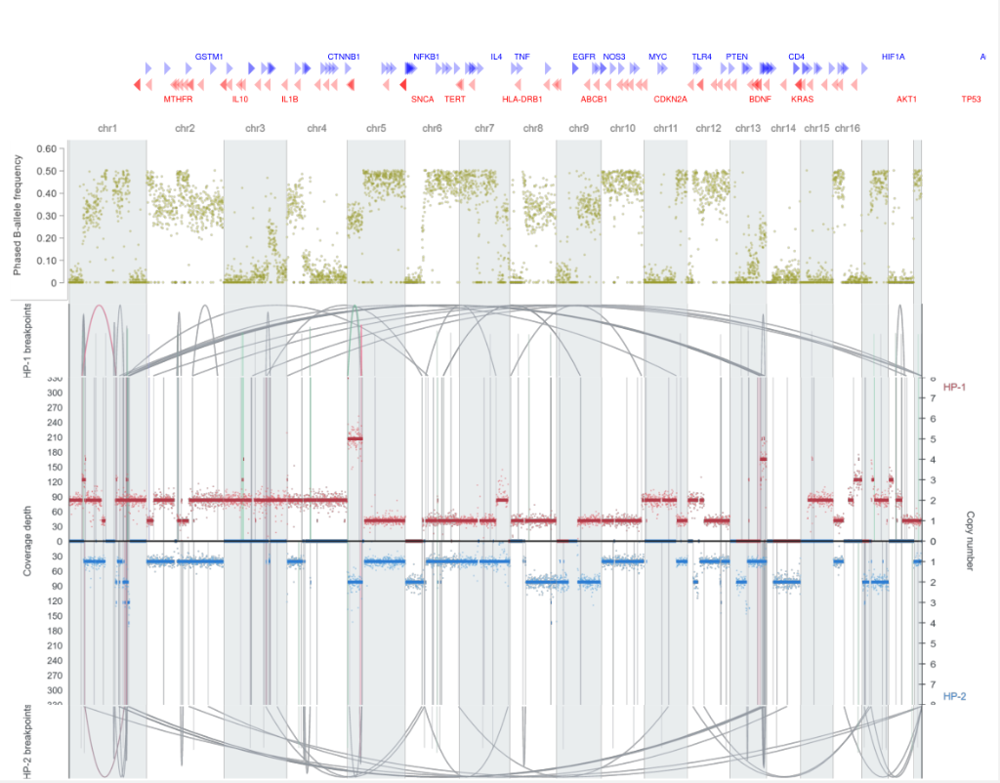
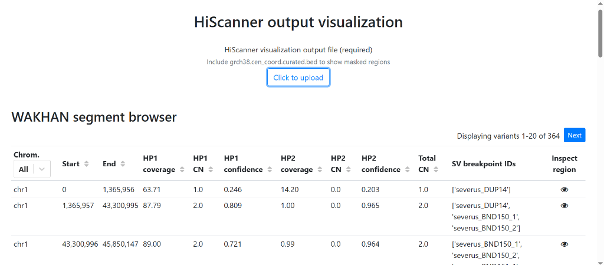

# ViScanner

ViScanner is an interactive web-based visualizer for single-cell Copy Number Alterations (CNA), B-Allele Frequencies (BAF), Haplotype-Specific Coverage (HP1 / HP2), and Structural Variant (SV) breakpoint exploration.

[Live Application Demo](https://wakhan-visualization.github.io/)

---

## Features

- **Multi-Pipeline Integration**: Native support for WAKHAN haplotype phasing, Severus structural variants, and classic HiScanner outputs (raw files or .zip archives).
- **Mirrored Haplotype Track**: Dual-axis mirrored coverage for HP1 and HP2 with live depth/CN point scaling and LOH region overlays.
- **Phased Structural Variant Arcs**: Haplotype-aware Severus SV breakpoint arcs (DEL, INS, INV, DUP, BND).
- **Multi-Build Centromere Masking**: Dynamic switching between GRCh38, GRCh37, and CHM13 reference genome builds.
- **Interactive Segment Browser**: Filterable table with region inspection and dynamic canvas navigation.

---

## Interface Previews

### Multi-Track Genome Browser


### Segment Table and Uploader


---

## Supported Input Files

Upload raw individual files or a single .zip archive containing:

| File Name | Format | Description |
| :--- | :--- | :--- |
| `phase_corrected_coverage.csv` | CSV | Dense phase coverage depth points (`chr`, `start`, `end`, `hp1`, `hp2`, `unphased`) |
| `*_copynumbers_segments_HP_1/2.bed` | BED | HP1 / HP2 copy-number segments & confidence scores |
| `baf.csv` | CSV | B-Allele Frequency values (`chr`, `start`, `end`, `baf`) |
| `severus_somatic.vcf` | VCF | Severus somatic structural variants (PASS filtered) |
| `grch38.cen_coord.curated.bed` / `grch37` / `chm13` | BED | Centromere masked region coordinates |
| `*_LOH*.bed` / `loh_regions.bed` | BED | Loss of Heterozygosity (LOH) region coordinates |
| `cna_long.txt` / `cna_short.txt` | TSV | Classic HiScanner CNA segment files |

---

## Development and Deployment

### Prerequisites
- Node.js (v16.x or newer)
- npm (v8.x or newer)

### Installation
```bash
git clone https://github.com/wakhan-visualization/wakhan-visualization.github.io.git
cd wakhan-visualization.github.io
npm install
```

### Local Development
To start the local development server:
```bash
npm start
```
The application will be available at `http://localhost:3030`.

### Running Tests
```bash
npm test
```

### Updating Example Data
To regenerate the bundled in-memory dataset from `examples/source_files/`:
```bash
npm run update-example-data
```

### Deploying to GitHub Pages
To compile the production bundle and publish live to GitHub Pages:
```bash
npm run deploy
```

---

## Git Workflow

To commit and push updates to GitHub:
```bash
git add -A ; git commit -m "Describe your changes" ; git push origin main
```
*(On Linux/macOS, you can use `git add -A && git commit -m "..." && git push origin main`)*

